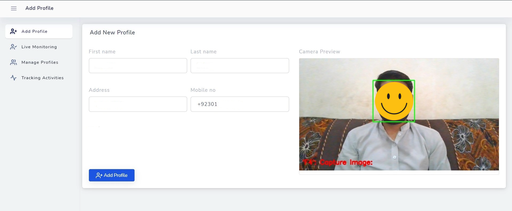

# Customer-Tracking-App-2020
This repository contains the code for a Face Recognition Customer Tracking Application developed to aid restaurant owners in Pakistan's current guidelines for COVID-19 management. Instead of manually documenting customers' details, this application captures customers' face images, basic personal details, and time of visit. For repeating customers, their faces are recognized by the system. Data from this application can be used for contact tracing and alerting restaurant owners to take precautions for customers in the high-risk category. This project aims to automate this process through a web application that captures customers' face images, along with their basic personal details and time of visit. The main features of the application include:
- **Face Recognition**: The application uses [FaceNet](https://github.com/davidsandberg/facenet/tree/master) pre-trained deep learning model to recognize repeating customers' faces.
- **Data Storage**: The application stores customers' data in MySQL database, which can be used for contact tracing and alerting restaurant owners to take precautions for customers in the high-risk category.
- **User Interface**: The application provides a user-friendly interface for restaurant owners to add, view and manage customers' data.


## Features
- **Face Registration**: On the customer's first visit, their face is recorded, and their personal information is manually entered by the restaurant owner. The customer's face is then stored in the database. 
- **Face Recognition**: For returning customers, the system identifies their face and displays their basic personal information along with their previous visit details, including date, time, and body temperature.

## Technologies
- **Frontend**: HTML, CSS, JavaScript, Bootstrap
- **Backend**: Python, Flask
- **Database**: MySQL
- **Face Recognition**: FaceNet pre-trained deep learning model, OpenCV, TensorFlow, Keras

## Installation
1. Clone the repository: 
```bash
git clone 
```
2. Install the required packages:
```bash
pip install -r requirements.txt
```
3. Install MySQL and create a database named `customer_tracking_app`. Then, create a table named `customers` with the following schema:
```sql
CREATE TABLE customers (
    id INT AUTO_INCREMENT PRIMARY KEY,
    name VARCHAR(100) NOT NULL,
    phone_number VARCHAR(15) NOT NULL,
    email VARCHAR(100) NOT NULL,
    address VARCHAR(100) NOT NULL,
    date_of_birth DATE NOT NULL,
    date_of_visit DATE NOT NULL,
    time_of_visit TIME NOT NULL,
    body_temperature FLOAT NOT NULL,
    face_image_path VARCHAR(100) NOT NULL
);
```
4. Run the application:
```bash
python app.py
```
5. Open your web browser and go to `http://localhost:5000` to use the application.

## Usage
1. **Add Customer**: To add a new customer, click on the `Add Customer` button, a user interface with opened webcame will be open, capture the customer face and fill in the required details. Then, click on the `Add` button to add the customer to the database.
2. **View Customers**: To view all the customers, click on the `View Customers` button. This will display a list of all the customers along with their basic personal details and time of visit.
3. **Search Customer**: To search for a specific customer, click on the `Search Customer` button and enter the customer's name. This will display the customer's basic personal details and time of visit.
4. **Update Customer**: To update a customer's details, click on the `Update Customer` button and enter the customer's name. Then, update the customer's details and click on the `Update` button to save the changes.
5. **Delete Customer**: To delete a customer, click on the `Delete Customer` button and enter the customer's name. Then, click on the `Delete` button to remove the customer from the database.
6. **Face Recognition**: To recognize a customer's face, click on the `Face Recognition` button. This will open the webcam, and the system will recognize the customer's face and display their basic personal information along with their previous visit details.

## Note 
- Ensure that all dependencies are installed and the MySQL database is properly configured before running the application.
- The project is intended for educational and demonstration purposes only. 
- The dataset used for training the face recognition model is not provided. You may need to collect and annotate your own dataset for training purposes.